# RestoPOS — Laravel + React

**aplikasi POS restoran** dengan **Laravel 12 (Sanctum)** di backend dan **Vite + React + TS + MUI** di frontend.

---

## Fitur Utama

- **Guest**
  - Lihat daftar **meja** (available / occupied).

- **Waiter (Pelayan)**
  - Login.
  - **Open order** untuk meja available.
  - **Tambah item** (menu) ke order (quantity bertambah).
  - **CRUD Foods** (buat, ubah, hapus menu).
  - **Close order**.

- **Cashier (Kasir)**
  - Login.
  - Lihat daftar order & detail order.
  - **Close order**.
  - **Print receipt (PDF)**.

---

## Demo (Local)

### Prasyarat
- **PHP 8.3+**, **Composer**
- **MySQL** (atau Postgres)
- **Node.js 20+** & **npm**

### 1) Backend (Laravel)
```bash
cd backend
cp .env.example .env        # sesuaikan DB lokal
composer install
php artisan key:generate
php artisan migrate --seed  # buat tabel & data awal + user
php artisan serve --host=localhost --port=8000
```

**Akun seed:**
- Waiter: `waiter@test.com` / `password`
- Cashier: `cashier@test.com` / `password`

Backend: **http://localhost:8000**

### 2) Frontend (React + Vite)
```bash
cd frontend
cp .env.example .env
# VITE_API_BASE_URL=http://localhost:8000

npm install
npm run dev
```

Frontend: **http://localhost:5173**

---

## 📸 Catatan Screenshot (SS) per Role

### Guest
- **Tables (public)** — tampilan daftar meja `available/occupied`.  
  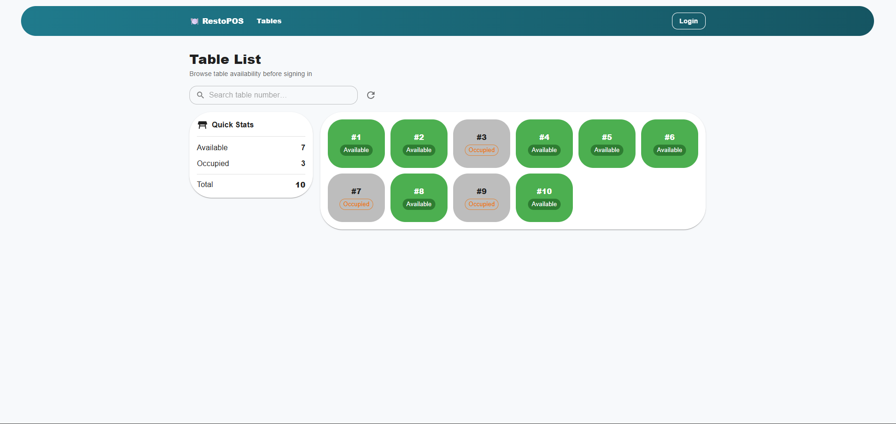

### Waiter (Pelayan)
- **Login** — form login sukses.  
  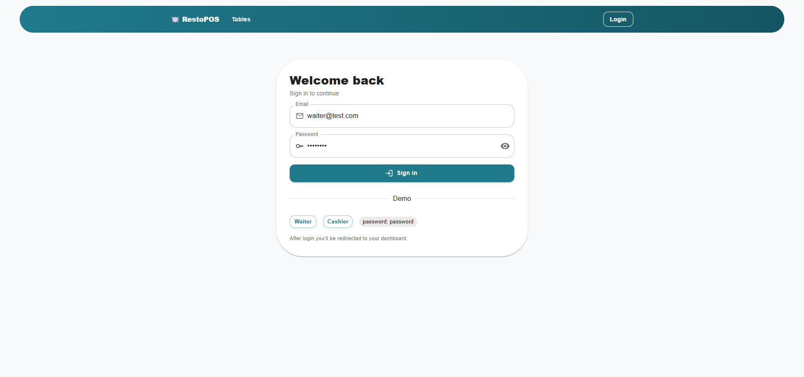

- **Dashboard/Tables** — sebelum open order (ada meja available).  
  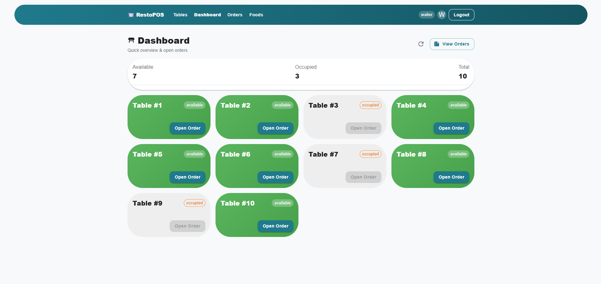

- **Order Closed** — setelah close order (status **Closed**).  
  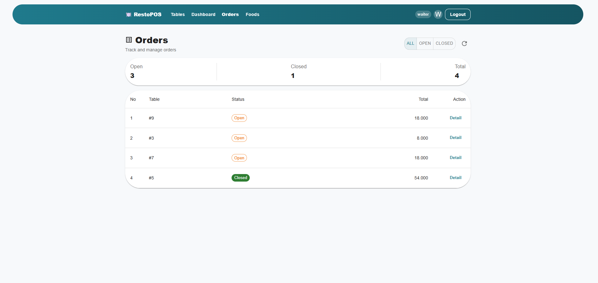

- **Order Detail (OPEN)** — setelah open order.  
  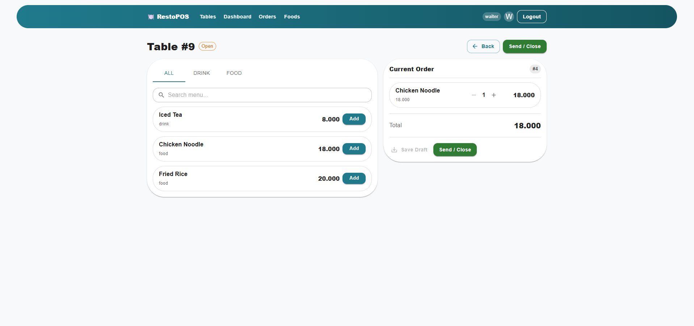

- **Foods (CRUD)** — list makanan + modal Add/Edit.  
  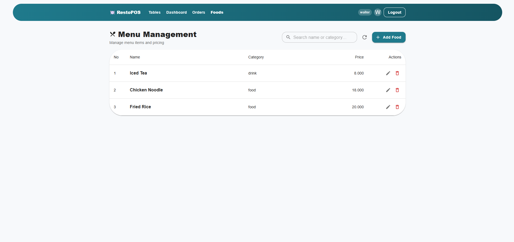

  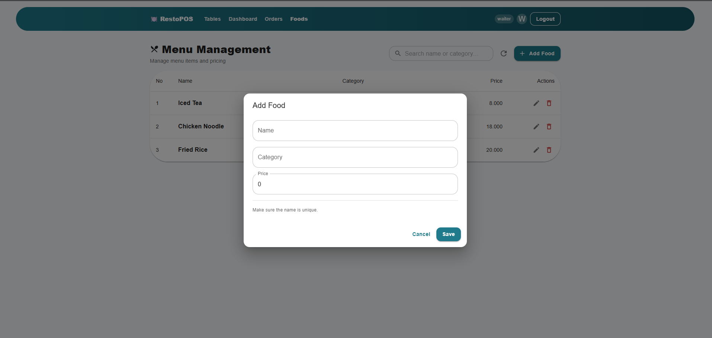

  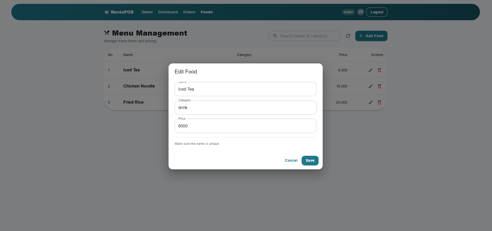

### Cashier (Kasir)
- **Login** — form login sukses.  
  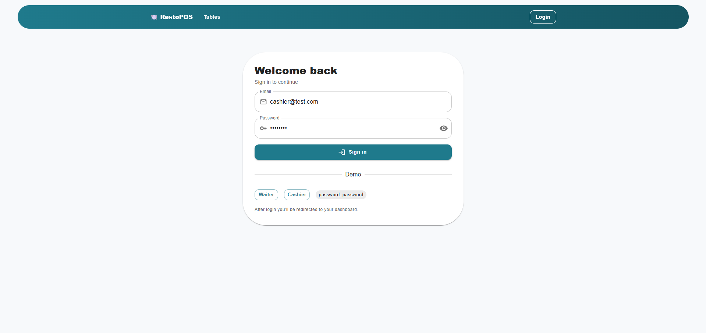

- **Orders List** — dengan filter (All/Open/Closed) & **No** berurutan 1..n.  
  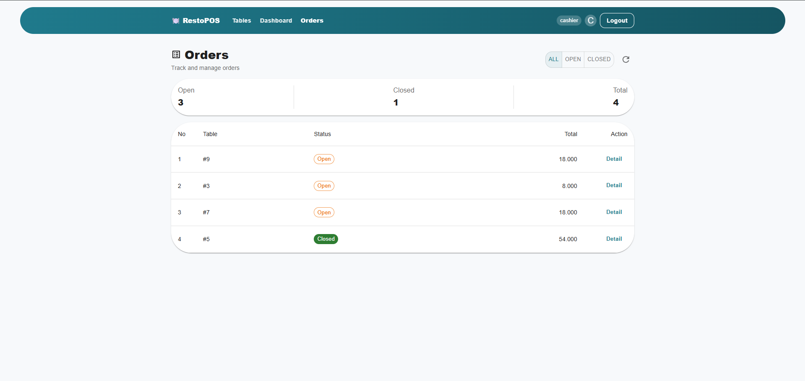

- **Order Detail (Closed)** — tombol **Print Bill** aktif.  
  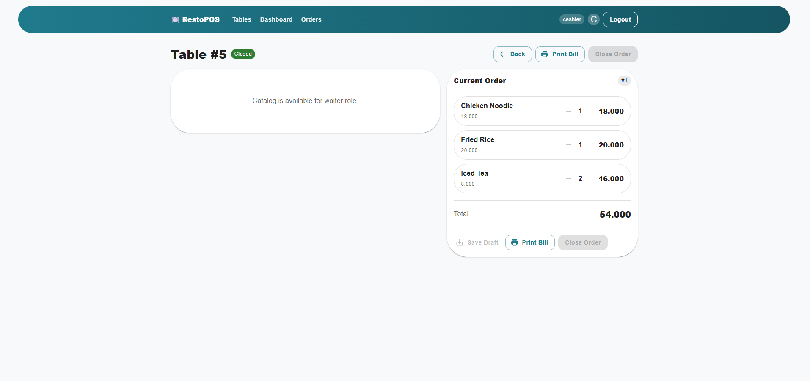

- **Receipt (PDF)** — hasil unduhan.  
  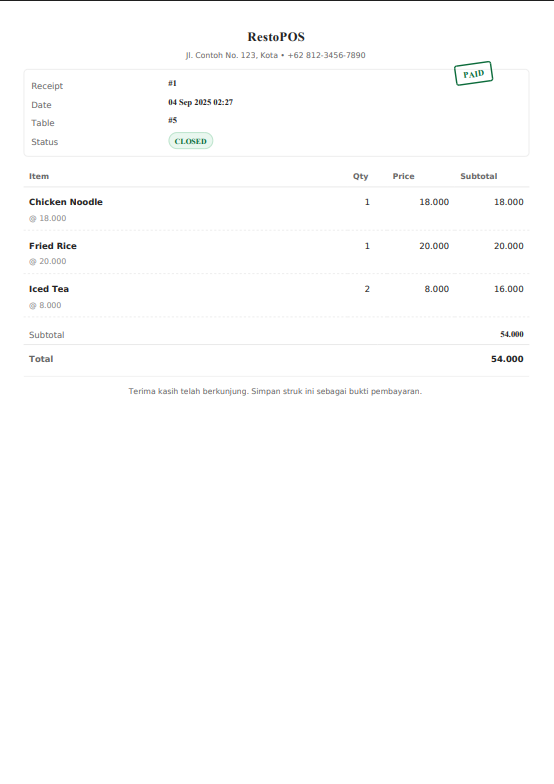
